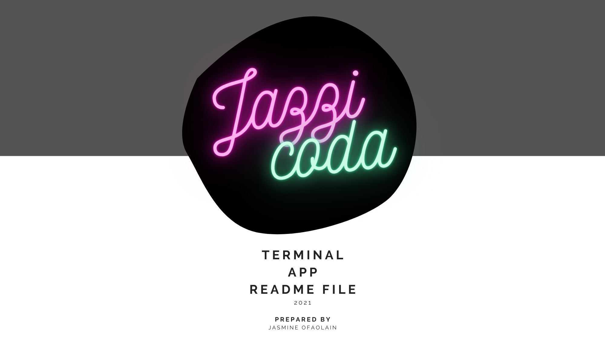
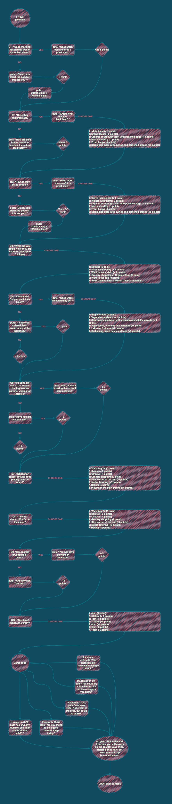

 
===============
TERMINAL APP DOCUMENTATION
===============

Presented by: Jasmine Ofaolain
------------------------------
Assignment: T1A3
------------------------------

## GITHUB REPO
For access to the GitHub Repository for this app, [CLICK HERE](https://github.com/jazzicoda/jazzicoda-Terminal_App).

## STATEMENT OF PURPOSE
Modern day parenting is a balancing act! Be “too caring” towards your child and you are judged as being “crunchy”. Breastfeed you child and be judged as a lactivist! Bottle feed your child and be judged for not giving your child the best start to life. Feed your kid processed food? Look out, you will be judged! It really is a minefield out there! 

This app is a tongue-in-cheek game considering some of those concepts - lets see if you really are a terrible parent.

## WHAT DOES THE APP DO?
"The Judged Parent Game" is a short and sweet 'game' which asks various questions throughout one day in the life the player's "child" (real or fictitious, you decide). Actions are scrutinised and responses are scored. 

## WHAT PROBLEM IS THIS APP SOLVING?
World hunger and world peace.... are NOT going to be solved by this app! It is just a bit of frivilous fun. Since becoming a parent myself, it is obvious how everyone has VERY STRONG opinions of how we should parent our kids. This is simply a fun little game to shine a light on this social norm, and maybe make the player consider their future judgements.

## TARGET AUDIENCE
TBA.........

|User Story |Acceptance Criteria|
|:---:|:---:|
|As a parent, Greta doesn't have much time for games.|Design an app which doesn't take long to play, to attract Greta|
|As a parent|Include: education, resume, tech stack|
|As a prospective employer, I want to know what tech stack Jasmine has accomplished, so i know if she has the skills I require on my team| Show tech stack as a visual for easy identification of skills|
|As a prospective employer, I want clear navigation, so I can find my way around the site easily.| Easy, fully linked Nav Bar. Easy access to github, etc|
|As a prospective employer, I want to know how I can get in contact with Jasmine, so I can offer her a job.|Include a contact form, email address, and access to socials to make contact|

## FEATURE ONE
# Using file for User System

## FEATURE TWO
# Interactive menu system

## FEATURE THREE
# Calculating score based on answers 

## FLOW CHART
Below are the 2 main flow charts for my app. 

Initialise and run program until games menu:
 

Game play 
 

## IMPLEMENTATION PLAN 
Trello was used for project management throughout the project.

## PROJECT MANAGEMENT
Trello was used for project management throughout the project. I created multiple lists and cards from the assignment brief and created check boxes within each card to keep track of individual tasks. Dates were assignend to some cards to ensure I kept on track and the project would be completed on time. Important documents such as the submission layout were uploaded as a visual guide and the 
I took regular screenshots of the use of Trello board throughout the project. 

But you can see the rest of them [HERE](https://docs.google.com/document/u/2/d/e/2PACX-1vTv5MLhcjZVJTID-RodnFd9oYD89nNbIfeOWxKo1DkSruCfaxzoYbQhUk6mHS_Y9mrHi-2D7oAb0hCQ/pub).

## HELP DOCUMENTATION

