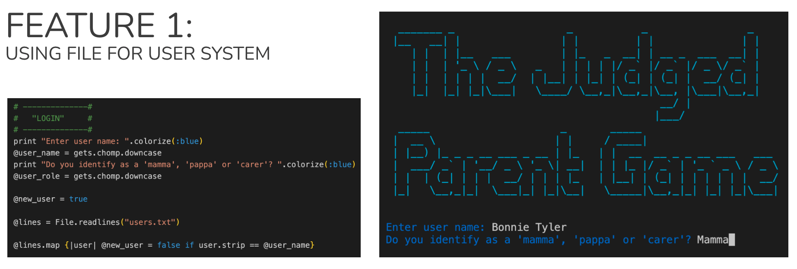
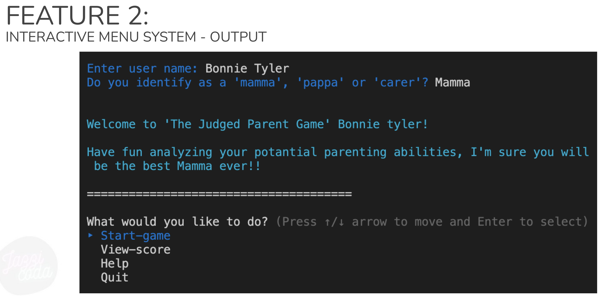
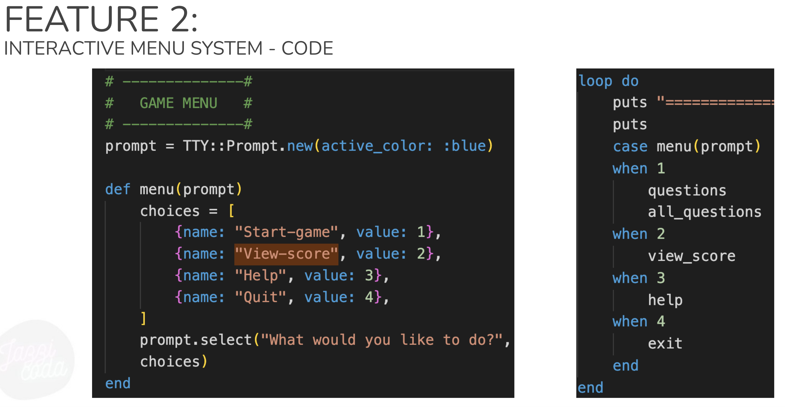
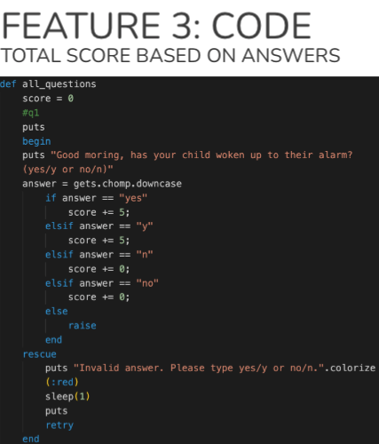
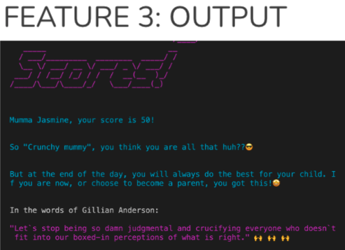
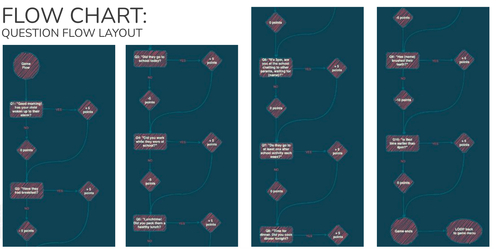
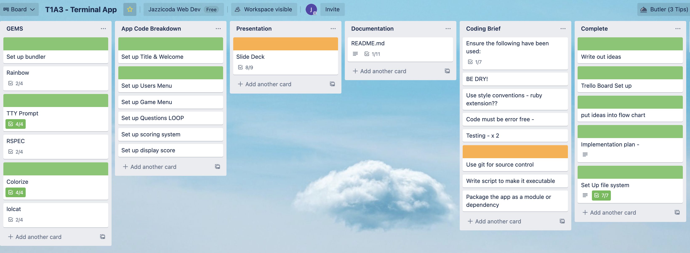
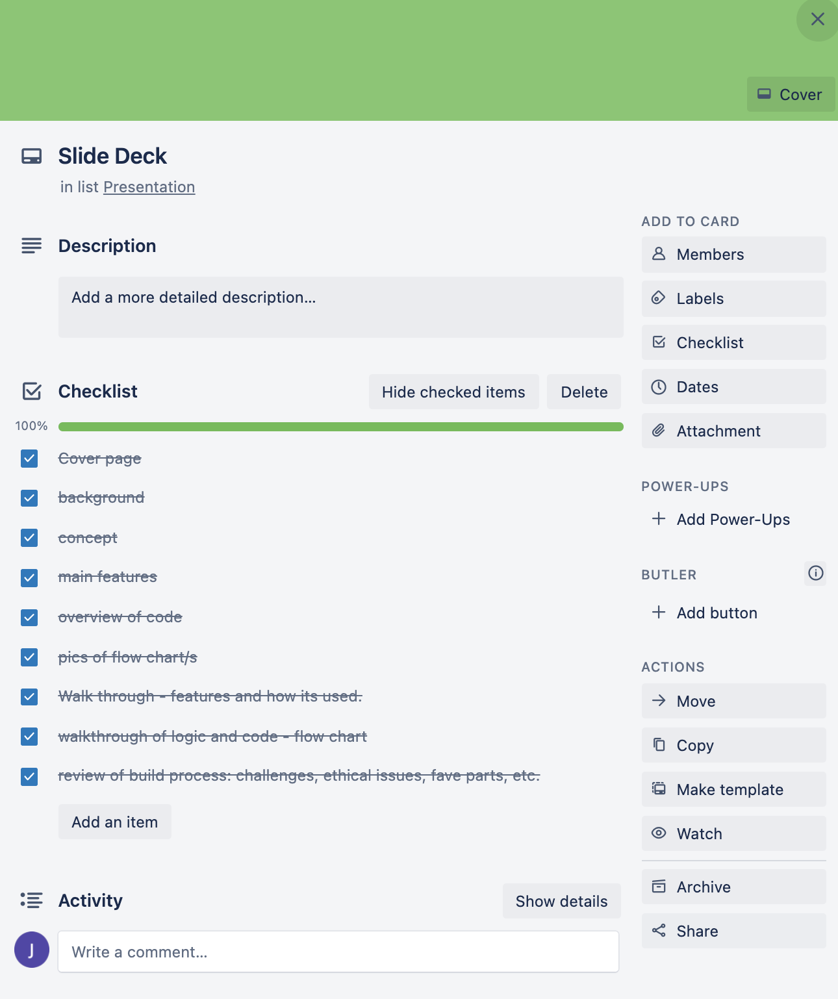
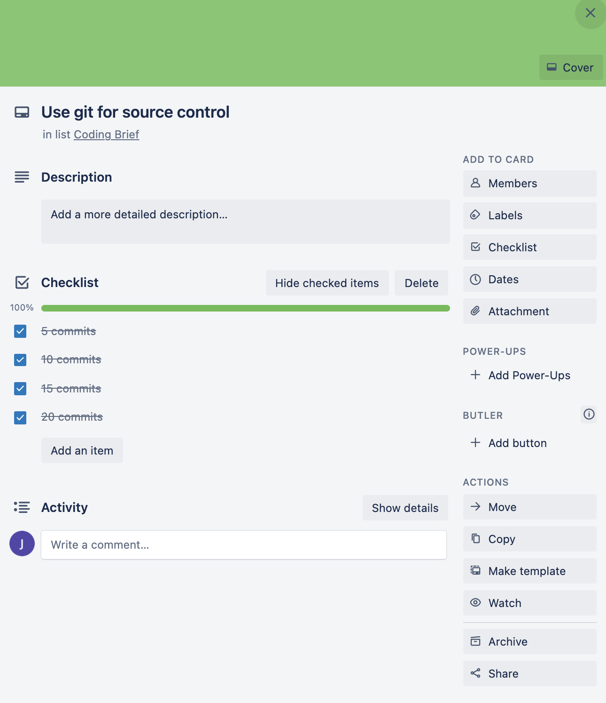

 
===============
TERMINAL APP DOCUMENTATION
===============

Presented by: Jasmine Ofaolain
------------------------------
Assignment: T1A3
------------------------------

## GITHUB REPO
For access to the GitHub Repository for this app, [CLICK HERE](https://github.com/jazzicoda/jazzicoda-Terminal_App).

## STATEMENT OF PURPOSE
Modern day parenting is a balancing act! Be “too caring” towards your child and you are judged as being “crunchy”. Breastfeed you child and be judged as a lactivist! Bottle feed your child and be judged for not giving your child the best start to life. Feed your kid processed food? Look out, you will be judged! It really is a minefield out there! 

This app is a tongue-in-cheek game considering some of those concepts - lets see if you really are a terrible parent. 

## WHAT DOES THE APP DO?
"The Judged Parent Game" is a short and sweet 'game'. It asks various questions throughout one day in the life the player's "child" (real or fictitious, you decide). Actions are scrutinised and responses are scored. 

As the user makes their way through the game questions, they are asked whether their "child" (or the "parent/carer") has completed certain tasks throughout the day. Each task is allocated a score value. Aat the end of the "day", the player is given an accumulated score..

At the end of the day there is generally a happy ending. (No spoilers here!!)

## WHAT PROBLEM IS THIS APP SOLVING?
World hunger and world peace.... are NOT going to be solved by this app! But it is a fun app which uses humour to shine a light on some more serious issues. Since becoming a parent myself, it has become very obvious to me that everyone has VERY STRONG opinions of how we should parent our kids. This app pushes that theory and makes a fun little game that shines a light on this social norm. Maybe it will make the player consider their future judgements more carefully.

## TARGET AUDIENCE
The target audience for this app/game is parents, or those wanting to be parents, or anyone really. It is a small insight into being a parent, so anyone who has an interest could play this game. The questions aren't hard, so anyone, of any age could use this game.

## APP FEATURES

 
This feature utilises the GETS method and USER INPUT to gather information about the user. If the user is playing for the first time, their name is pushed to the users.txt file within the src directory. This will alter how the welcome message displays - whether they receive the 'new user' intro, or the 'welcome back' message. 

Next, the user is asked whether they identify as "Mumma", "Pappa" or "Carer" - this will accept any input string so it is customisable depending on how the user identifies themselves. This data is used to customise the welcome message, but is not stored in the text file. I may implement this feature in future development of this app.  
 
 
 
 
To create an clear, simple aesthetically pleasing menu system, I utilised the TTY-Prompt Gem. It helps to make the Game Menu easy to follow and user friendly, with minimal room for error as the tty-prompt has very specific constraints.

A choice array has been used to feed the four menu options into the prompt command. A loop has been utilised with a case method to display the list of menu items, and this continues to return the user to the menu once they have finished with each feature of the game.

 
 
 
To make the scoring feature of the app work, each question has a ‘yes’ or ‘no’ answer. Each answer has a score value associated with it. When the user puts in their yes or no answer, using gets.chomp.downcase, the acore associated with that is stored inside the score variable. The score is accumulated in each step of the loop (ie per question).

If the user types an incorrect string (other than yes, y, no, n) the resulting error is handled with rescue-retry-end error handling.

Using string interpolation, the score variable is called in the View-score area. To personalise the user experience, the user name and role are used in the score output. Further personalisation is achieved by displaying an different message depending on the score.

At the end of this feature, all users receive the “But at the end of the day...” message and the Gillian Anderson quote. As an added feature, the Espeak Gem is used to speak the Gillian Anderson quote out loud.

## FLOW CHART
Below are the flow charts for my app. 

### Initialise and run program until games menu:  
The flowchart below illustrates the flow of information and the relationships from the moment the program is launched up until the game menu is engaged, and a selection from the menu is made. 
 
 

### Game play  
This flowchart illustrates the order of questions as well as the allocation of points for each question. This layout made it very easy to execute the coding of the app. It was a matter of following the steps and coding them into the ruby file. Once game play has been initiated, the flow is very linial, only wavering to include the allocation of points. 
 
 

## IMPLEMENTATION PLAN 
The implimentation of this app took place in three main stages:
- Planning
- Coding
- Documenting

*PLANNING* 
My approach to implementing the project was to develop my initial idea for an app. This idea was teased out and I was able to come up with comprehensive flowcharts which layed the foundations for my coding.

*CODING* 
Once the flow charts were finalised, I moved into the coding phase. I utilised TDD (test driven development) throughout the process. As a junior developer, I am continuously saving and running my coding to check that my logic is sound, and that my code is error free. I find it easier to do this regularly so that it is easier for me to backtrack and work out what my errors (along with the assistance of Ruby's wonderful error messaging). While I do this testing continuously, I have noted down a few of these test I have run in this [Manual Testing Documentation](https://docs.google.com/spreadsheets/d/e/2PACX-1vT0KFBQAjzekraiURus3QTB79vqDB22bzV3vBm833K1DO5YLtuwRM0J1K50ruyGaJ0HwQ0yYBwYxm8A/pubhtml). Wherever possible I go back and refactor code. I know by the end of this bootcamp I will look back on this project and take to it with a fine toothcomb - refactoring all of the messy code within. I am still learning, so I am not there yet.

*DOCUMENTING* 
Documentation for the project has been produced using various programs:
- Google suite (docs, slides, sheets)
- Trello
- Canva
- VS Code
The documentation has been concisely compiled in this .md document for ease of access for future users and developers.

## PROJECT MANAGEMENT
Trello was used for project management throughout the project. I created multiple lists and cards from the assignment brief and created check boxes within many cards to keep track of individual tasks. This broke the larger tasks down into more managable tasks. Dates were assignend to some key cards to ensure I kept on track and the project would be completed on time.

Colour coding was used to signify when items were "In Progress" (orange), "Complete" (green), or "Urgent" (red) 

I took regular screenshots of the use of Trello board throughout the project. Below are a few key snapshots of this process. 
 
 
 

 

More screen shots of the Trello Board are available [HERE](https://docs.google.com/document/d/e/2PACX-1vQun1kX_xLPlq6ESECmtacSUUYXoFzPxHu7fg89LZiRIj5RkhIwrdd6nvucdTN5mywYY0iLMD6mVxQ2/pub).

## HELP DOCUMENTATION
To install THE JUDGED PARENT GAME, run the *run_program.sh* command in your local Terminal.

This will launch the app in your terminal and the games will begin!

Dependencies
The following Ruby Gems are required for the app to run:
- "colorize", "~> 0.8.1"

- "artii", "~> 2.1"

- "tty-prompt", "~> 0.23.1"

- "espeak-ruby", "~> 1.0", require: "espeak"

## REFERENCES

- Brandon J, 2020, Ruby Error Handling, Academy of Information Technology

- Brandon J, 2020, Ruby Gems, Academy of Information Technology

- Brandon J, 2020, Ruby Gems Bundler, Academy of Information Technology

- Brandon J, 2020, Ruby Inheritance and Mixins, Academy of Information Technology

- Brandon J, 2020, Test Driven Development (TDD), Academy of Information Technology

- Brandon J, 2020, Testing Ruby with Rspec, Academy of Information Technology

- Nayak N, 2020, Methods, Academy of Information Technology

- Nayak N, 2020, Iterators, Academy of Information Technology

